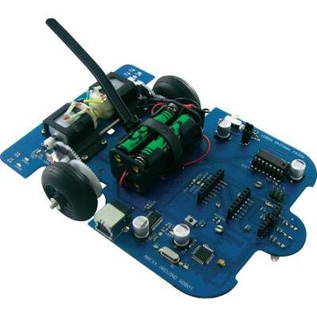

# AREXX AAR-04 ARDUINO ROBOT - Pin definition

Incomplete list of pin definitions for the AREXX AAR-04 ARDUINO ROBOT.

**Table of Contents**
- [Intention](#intention)
- [AREXX AAR-04 Programmable Arduino Robot](#arexx-aar-04-programmable-arduino-robot)
- [LICENSE](#license)

## Intention
I lent me a AAR-04 AREXX ARDUINO ROBOT out and wanted to create some simple little projects. For this I didn't want to define every single project all pins again and again. Due to that I created a global header file which I copied to the library directory. Now I only need to add this header file and can use all pin definitions I already defined.

## AREXX AAR-04 Programmable Arduino Robot
The folowing details are from [Conrad](http://www.conrad.com/ce/en/) an electronic shop and can be found [here](http://www.conrad.com/ce/en/product/191694/Arexx-AAR-04-Programmable-Arduino-Robot). 
<small>_Links and data are from 9th of May 2016._</small>

### Highlights & details
- Easy programming based on C-dialect
- Integrated USB programmer and ISP connector
- Ideal for school and education

### Description
There are a number of ways to build an Arduino robot itself, finished with this device, but you can start immediately. The Arduino robot is an autonomous robot multisensorieller. Besides two Odometersensoren and an optical unit to track a line he has an SMD display, LED indicators, and free programmable I / O's. With the integrated USB programmer is comfortable programming via PC via USB, there is also an ISP connector for bootloader programming. The programming is done in a Arduino open-source development environment that is based on a simplified C-dialect. This Arduino robot is simplified by the C programming language dialect very well suited for school and education.

### Features
- AVR RISC Processor (ATmega328P)
- Optical linestring unit
- LED indicators
- Compatible with ASURO Expansion Kit.
 
### Documentation
The documentation can be found [here](/docs)

## LICENSE
GNU General Public License v3.0 
For more information see LICENSE file.
